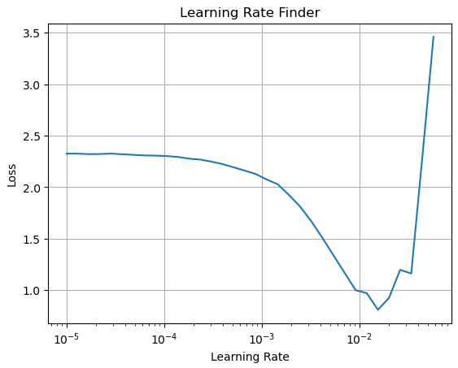
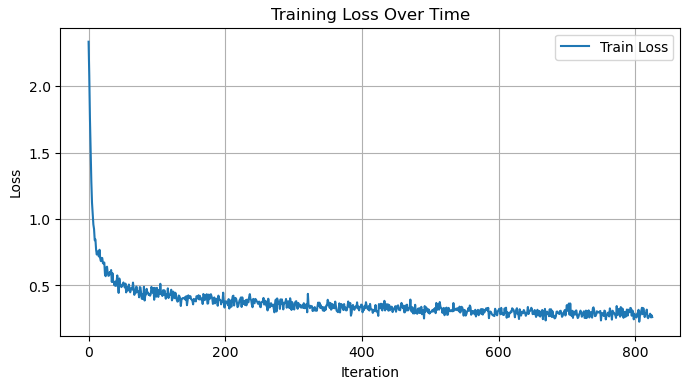
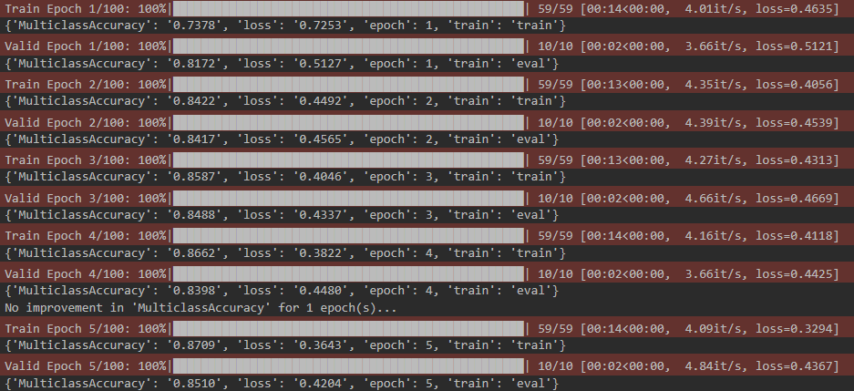

# MiniLearner

**MiniLearn** is a lightweight yet powerful deep learning training framework built on top of PyTorch. It draws significant inspiration from both the fastai library and the mini-learn framework presented in the fast.ai course.
It was created to find a middle ground between **flexibility** and **iterative development speed**, making it easier to train models quickly without sacraficing any control over the training process.

---

## Motivations

While PyTorch provides excellent control, it often comes at the cost of painfully slow iteration speed. The process of writing full training loops, checkpointing, metrics, and learning rate schedules can require a lot of boilerplate code.

On the other end of the spectrum, other high-level libraries abstract away most of the training pipeline, which increases speed but often obscures the underlying processes and limits customizable behavior.

By building this framework, I aimed to accomplish these goals:
- Create a reusable and extensible architecture for ML experimentation
- Deeply understand how training loops, callbacks, and metric tracking work from scratch
- Provide a lightweight framework that simplifies training without sacrificing PyTorch’s flexibility
- Improve iteration speed, enabling faster cycles of training, testing, and tweaking, ultimately yielding improved results.

---

## Inspiration & Credit

This project is heavily inspired by the design of [fastai](https://github.com/fastai/fastai), particularly its modular training loop, flexible callback system, and the use of exceptions to control training flow. A significant influence on this project was [Lesson 16](https://course.fast.ai/Lessons/lesson16.html) of the fast.ai course, in which Jeremy Howard demonstrates the process of building a simplified training framework. 

MiniLearn builds on these ideas and takes them further by creating a more complete, reusable framwork. While many design patterns reflect the fastai approach, all components in this project have been implemented from the ground up with the goal of reinforcing my understanding of the internals of deep learning.

---

## Features

- Flexible `Learner` class with a full training loop
- Callback system for controlling behavior at every stage (`before_fit`, `after_batch`, etc.)
- Built-in metric tracking using `torcheval`
- Hook system for activation analysis
- Automatic checkpointing to save the best-performing model based on a chosen metric  
- Early stopping to halt training when no improvement is observed after a specified patience period
- Integrated progress bar and live loss plotting
- Learning Rate Finder with automatic early stopping

---

## Gallery

A few visual examples of MiniLearn's features in action:

### Learning Rate Finder
Automatically explores a range of learning rates and plots the corresponding losses



---

### Training Loss Plot
Plots training loss over time when enabled through the `ProgressCB` callback.



### Training Progress Bars
Real-time feedback for training and validation using `tqdm`



---

## Project Structure

<pre>
minilearn/
├── callbacks.py       # Metric tracking, checkpointing, progress bars, early stopping
├── learner.py         # Core Learner class with training logic
├── hooks.py           # Hook-based debugging tools
├── lr_finder.py       # Learning rate scheduler
├── metrics.py         # Metrics wrapper around torcheval
├── utils.py           # Device and tensor handling
checkpoints/           # Saved model checkpoints (auto-created during training)
main.ipynb             # Example training run on fashion mnist dataset
requirements.txt       # Dependencies
README.md              # This file
</pre>

---

## Example Usage

```python
from minilearn.learner import Learner
from minilearn.callbacks import *
from torcheval.metrics import Multiclass Accuracy

learn = Learner(model, tdl, vdl, loss_func, lr=1e-3, cbs=[ 
    MetricsCB(MulticlassAccuracy()),
    DeviceCB(),
    ProgressCB(plot=True),
    CheckpointsCB(monitor='loss'),
    EarlyStoppingCB(patience=3)
])

learn.fit(10)
```

## Installation

Install the required packages:
```bash
pip install -r requirements.txt
```

## Example Notebook

See `main.ipynb` for a step by step walkthrough of training a model with MiniLearn, using callbacks, metrics, hooks, and the learning rate finder.


